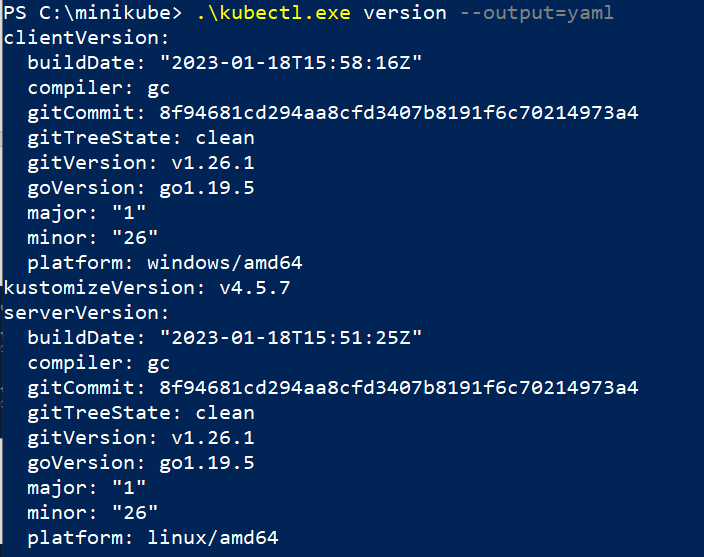
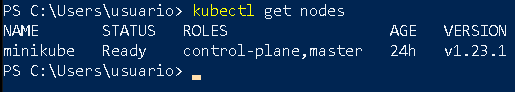

# Instalación y configuración de kubectl en windows

Podemos encontrar la información donde nos explican la instalación de `kubectl` en la [documentación](https://kubernetes.io/docs/tasks/tools/install-kubectl-windows/). Vamos a elegir la opción de descargar el ejecutable, para ello accedemos a la PowerShell como administrador y en el directorio `C./windows/system32` descargamos el ejecutable (por lo que lo vamos a tener disponible en el PATH). Para ello vamos a ejecutar:

```
curl.exe -LO https://storage.googleapis.com/kubernetes-release/release/v1.26.0/bin/windows/amd64/kubectl.exe
```

Una vez instalado, desde una PowerShell sin acceso como administrador, podemos empezar a usar `kubectl` y comprobar si podemos acceder al clúster.

Podemos comprobar la versión de `kubectl`:



Y ejecutar nuestro primer comando para obtener los nodos del clúster:

