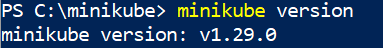
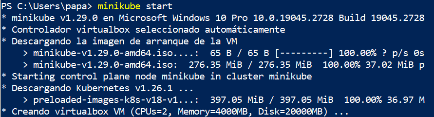
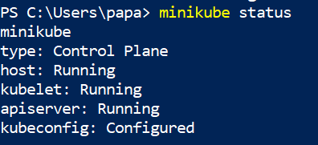
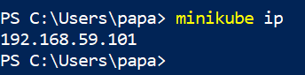

# Instalación de minikube en Windows + VirtualBox

En este apartado vamos a instalar minikube utilizando como sistema de virtualización VirtualBox. 

**Paso 1: Instalación de VirtualBox**

Siga las instrucciones que encontrarás en la página oficial: [https://www.virtualbox.org/](https://www.virtualbox.org/).

**Paso 2: Descargamos minikube y lo instalamos**

Abrimos la PowerShell, como administrador, y ejecutamos :

```
New-Item -Path 'c:\' -Name 'minikube' -ItemType Directory -Force
Invoke-WebRequest -OutFile 'c:\minikube\minikube.exe' -Uri 'https://github.com/kubernetes/minikube/releases/latest/download/minikube-windows-amd64.exe' –UseBasicParsing
```

Esta instrucción va a crear un directorio en c:/minikube y ahí va a depositar el ejecutable `minikube.exe` (70MB).

Puedes seguir cualquier otro método de descargas que encontraras en la página oficial: [https://minikube.sigs.k8s.io/docs/start/](https://minikube.sigs.k8s.io/docs/start/).

A continuación, vamos añadir el binario minikube.exe al PATH:

```
$oldPath = [Environment]::GetEnvironmentVariable('Path', [EnvironmentVariableTarget]::Machine)
if ($oldPath.Split(';') -inotcontains 'C:\minikube'){ `
  [Environment]::SetEnvironmentVariable('Path', $('{0};C:\minikube' -f $oldPath), [EnvironmentVariableTarget]::Machine) `
}
```

**IMPORTANTE: Debemos cerrar la sesión, para que se cargue las variables de entorno.**

Podemos ver el valor del path: `dir env:path|fl`

**Paso 3: Creación del clúster de kubernetes con minikube**

En este apartado vamos a crear un clúster de kubernetes de un nodo. En este caso minikube creará una máquina virtual (de 2Gb de RAM, 2 vcpu y 20G de almacenamiento) en VirtualBox utilizando una imagen que configura la máquina con kubernetes. 

Cerramos el terminal PowerShell y la volvemos abrir como administrador.

Averiguamos la versión de minikube :



Ejecutamos `minikube start` para que construya el clúster:



No hace falta indicar el driver, pero si tenemos algún problema podemos ejecutar `minikube start - -driver=virtualbox`. Lo debe coger automáticamente. No es necesario, tener abierto VirtualBox.

Comprobamos el estado de minikube:



Podemos averiguar la IP asignada a la máquina donde se ha instalado el clúster ejecutando `minikube ip` (nos hará falta más adelante)(seguramente tu tendrás una ip diferente a la mostrada):



Cuando terminemos de trabajar con kubernetes es conveniente para la máquina, para ello: `minikube stop`. Y si por cualquier motivo necesitamos eliminar la máquina, ejecutaremos `minikube delete`.


