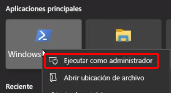
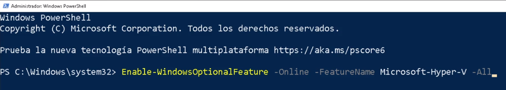
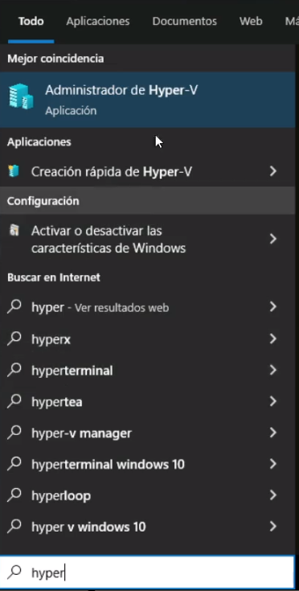
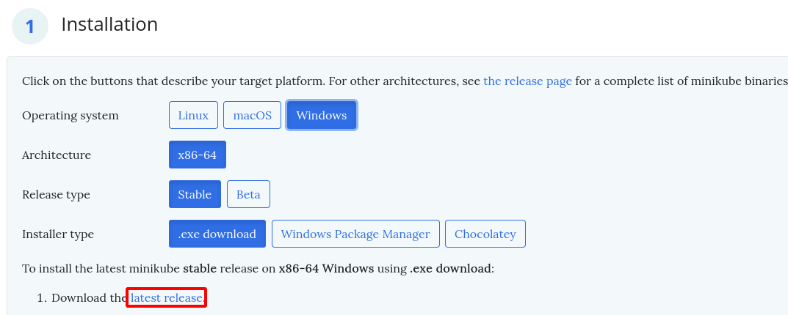
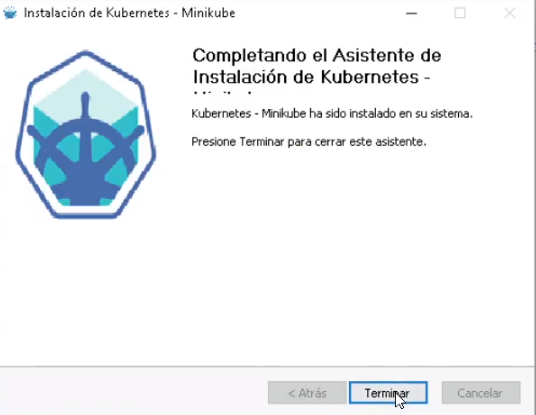
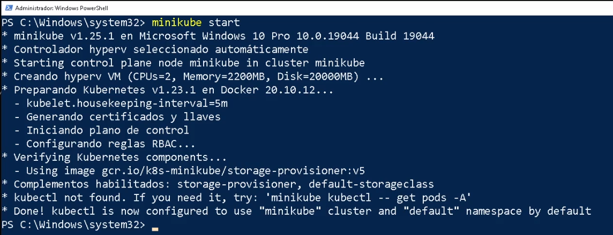
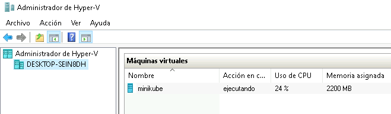
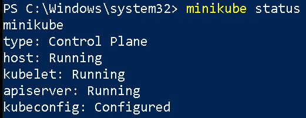
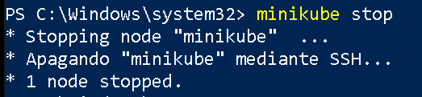
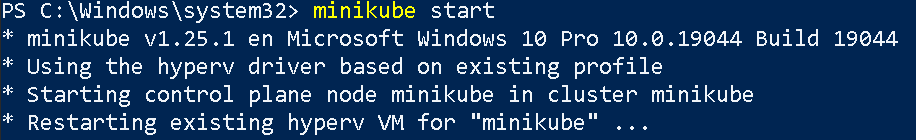

# Instalación de minikube en Windows + Hyper-V

En este apartado vamos a instalar minikube utilizando como sistema de virtualización Hyper-V. Lo primero que tenemos que indicar es que la instalación en Windows no se puede realizar en las versiones *Home* del sistema operativo. Por lo tanto en este ejemplo voy a utiliza un Windows 10 Profesional.

Otro aspecto a tener en cuenta es que Hyper-V y VirtualBox son incompatibles en la misma máquina. Si utilizas habitualmente VirtualBox, utilizalo junto a minikube para crear el cluster de kubernetes. Si optas por el uso de Hyper-V debes desinstalar el VirtualBox.

**Paso 1: Instalación de Hyper-V**

Para ello vamos a entrar en PowerShell como administrador:



Y ejecutamos la instrucción:

```
Enable-WindowsOptionalFeature -Online -FeatureName Microsoft-Hyper-V -All
```



Una vez instalado, nos pedirá que reiniciamos el sistema para terminar la instalación. Una vez reiniciado el sistema, podemos comprobar que ya tenemos el Administrador de Hyper-V instalado:



**Paso 2: Descargamos minikube**

Accedemos a [https://minikube.sigs.k8s.io/docs/start/](https://minikube.sigs.k8s.io/docs/start/)
y seleccionamos el método que prefiramos para instalar, eligiendo nuestro sistema operativo, arquitectura, etc.



Nos descargamos el fichero ejecutable `minikube-installer.exe` y lo ejecutamos para realizar la instalación:



**Paso 3: Creación del cluster de kubernetes con minikube**

En este apartado vamos a crear un cluster de kubernetes de un nodo. En este caso minikube creará una máquina virtual (de 2Gb de RAM, 2 vcpu y 20G de almacenamiento) en Hyper-V utilizando una imagen que configura la máquina con kubernetes. Para empezar volvemos a cceder a la PowerShell como administrador y ejecutamos la instrucción:

```
minikube start
```

Si nos da algún problema podemos probar con:

```
minikube start --driver=hyperv
```

Para más información puedes consultar la página [minikube con Hyper-V](https://minikube.sigs.k8s.io/docs/drivers/hyperv/) de la documentación.



Podemos acceder al Administrador de Hyper-V y comprobar que se ha creado la máquina:



Además podemos comprobar que el cluster está en funcionamiento ejecutando `minikube status`:



Cuando terminemos de trabajar con kubernetes podemos apagar la máquina virtual con el comando `minikube stop`:



Y en el momento que queramos seguir trabajando iniciaremos la máquina virtual ejecutando `minikubee start`:



## Vídeo

[https://www.youtube.com/watch?v=dr1G_aOaBek](https://www.youtube.com/watch?v=dr1G_aOaBek)
