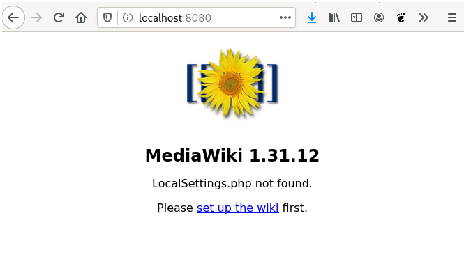
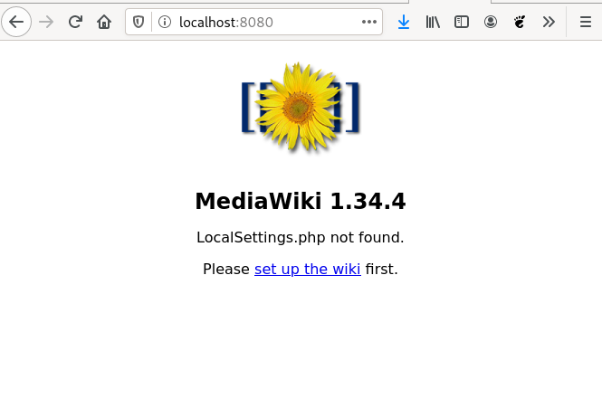

# Actualización y rollout de Deployment

El ciclo de vida del desarrollo de aplicaciones cuando trabajamos con contenedores nos facilita la labor de versionar nuestros desarrollos. Por cada nueva versión que se desarrolla de nuestra aplicación podemos crear una nueva imagen del contenedor que podemos versionar utilizando la etiqueta del nombre de la imagen.

Por lo tanto al crear un Deployment indicaremos la imagen desde la que se van a crear los pods. Al indicar la imagen podremos indicar la etiqueta que nos indica la versión de la aplicación que vamos a implantar.

Una vez que hemos creado un Deployment a partir de una imagen de una versión determinada, tenemos los pods ejecutando la versión indicada de la aplicación. 

¿Cómo podemos actualizar a una nueva versión de la aplicación? Se seguirán los siguientes pasos:

1. Tendremos que modificar el valor del parámetro `image` para indicar una nueva imagen indicando la nueva versión al cambiar la etiqueta. 
2. En ese momento el Deployment se actualiza, es decir, crea un nuevo ReplicaSet que creará nuevos pods de la nueva versión de la aplicación.
3. Según la estrategía de despliegue indicada se irán borrando los antiguos pods y se crearán lo nuevos.
4. El Deployment guardará el ReplicaSet antiguo, por si en algún momento queremos volver a la versión anterior.

Veamos este proceso con más detalles estudiando un ejemplo de despliegue:

## Desplegando la aplicación mediawiki

Vamos a partir del fichero  [`mediawiki-deployment.yaml`](files/mediawiki-deployment.yaml) para desplegar la aplicación:

```yaml
apiVersion: apps/v1
kind: Deployment
metadata:
  name: mediawiki
  labels:
    app: mediawiki
spec:
  replicas: 1
  selector:
    matchLabels:
      app: mediawiki
  template:
    metadata:
      labels:
        app: mediawiki
    spec:
      containers:
      - name: contenedor-mediawiki
        image: mediawiki:1.31
        ports:
        - containerPort: 80
```
Si nos fijamos vamos a desplegar la versión 1.31 de la aplicación mediawiki, creamos el despliegue:

    kubectl apply -f mediawiki-deployment.yaml --record

Con la opción `--record` vamos a registrar los comando que vamos a ejecutar a continuación para ir actualizando el despliegue. De esta forma al visualizar el historial de modificaciones veremos las instrucciones que han provocado cada actualización.

Podemos comprobar los recursos que hemos creado:

    kubectl get all

Y si accedemos al pod con un `port-forward` comprobamos que la versión actual de la mediawiki es la 1.31:

    kubectl port-forward deployment/mediawiki 8080:80



## Actualizar un Deployment

A continuación queremos desplegar una versión más reciente de la mediawki. Para ello tenemos que modificar el campo `image` de nuestro Deployment, esta operación la podemos hacer de varias formas:

1. Modificando el fichero yaml y volviendo a ejecutar un `kubectl apply`.
2. Ejecutando la siguiente instrucción:

        kubectl set image deployment/mediawiki contenedor-mediawiki=mediawiki:1.34 --record

Al ejecutar la actualización del Deployment podemos observar que se ha creado un nuevo ReplicaSet, que creará los nuevos pods a partir de la versión modificada de la imagen. ¿Cómo se crean los nuevos pods y se destruyen los antiguos? Dependerá de la estratégia de despliegue:

  * Por defecto la estrategía de despliegue es `Recreate` que elimina los Pods antiguos y crea los nuevos.
  * Si indicamos en el despliegue el tipo de estrategia como: `RollingUpdate`, se van creando los nuevos pods, comprueba que funcionan y se eliminan los antiguos.

Veamos los recursos que se han creado en la actualización:

    kubectl get all

Además podemos ver el historial de actualizaciones que hemos hecho sobre el despliegue:

    kubectl rollout history deployment/mediawiki

Y volvemos a acceder a la aplicación con un `port-forward` para comprobar que realmente se ha desplegado la versión 1.34.



## Rollout del Deployment

El proceso de despliegue de una nueva versión de una aplicación es una labor crítica, que tradicionalmente ha dado muchos problemas. Si estamos sirviendo una aplicación web que utilizan muchos usuarios, no nos podemos permitir que haya un corte en el servicio por un problema en el despliegue de una nueva versión.

Evidentemente los problemas que puede dar un despliegue de una nueva versión puede estar causado por muchos mótivos, y muchas veces es complicado tener todos los factores controlados y finalmente podemos tener algún problema, la pregunta sería: ¿Hemos diseñado un proceso que nos permita de una manera sencilla y rápida volver a la versión anterior de la aplicación que sabíamos que funcionaba bien?

A ese proceso de volver a una versión anterior de la aplicación es lo que llamamos **Rollout**, y veremos en este ejemplo que Kubernetes nos ofrece un mecanismo sencillo de volver a versiones anteriores. Como hemos comentado, las actualizaciones de los Deployment van creando nuevos ReplicaSet, y va guardando el historial de ReplicaSet. Hacer un Rollout será tan sencillo como activar uno de los ReplicaSet antiguos.

Ahora vamos a desplegar una versión que nos da un error (la versión 2 de la aplicación no existe, no existe la imagen `mediawiki:2`). ¿Podremos volver al despliegue anterior?

    kubectl set image deployment mediawiki contenedor-mediawiki=mediawiki:2 --record

Dependiendo de la estrategia de despliegue, esto puede provocar que la aplicación se quede en la versión anterior (`RollingUpdate`) o que no haya ningún pod válido desplegado (`Recreate`). En cualquier caso, se puede volver a la versión anterior del despliegue mediante rollout:

    kubectl rollout undo deployment/mediawiki
    kubectl get all

Y terminamos comprobando el historial de actualizaciones:

    kubectl rollout history deployment mediawiki
