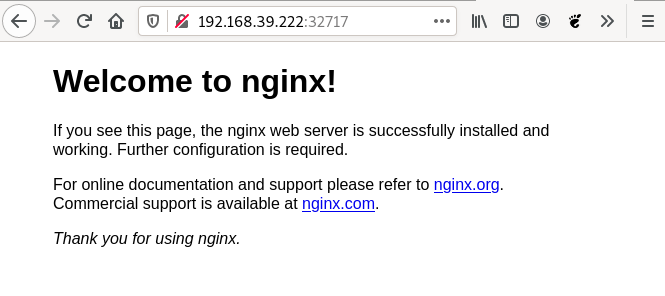

# Gestionando los Services

## Servicio de tipo NodePort

Para aprender cómo gestionamos los servicios, vamos a trabajar con el Deployment de nginx ([`nginx-deployment.yaml`](../modulo5/files/nginx-deployment.yaml)) y el servicio NodePort ([`nginx-srv.yaml`](files/nginx-srv.yaml)) para acceder a los Pods de este despliegue desde el exterior.

### Creamos el Deployment

El primer paso sería crear el Deployment de nginx:

    kubectl apply -f nginx-deployment.yaml

### Creamos el Service

A continuación vamos a crear el Service de tipo NodePort que nos permitirá acceder al servidor nginx.

    kubectl apply -f nginx-srv.yaml

Para ver los servicios que tenemos creado:

    kubectl get services

Recuerda que si usamos `kubectl get all` también se mostrarán los Services.

Antes de acceder a la aplicación podemos ver la información más detallada del servicio que acabamos de crear:

    kubectl describe service/nginx
    Name:                     nginx
    ...
    Selector:                 app=nginx
    Type:                     NodePort
    ...
    IP:                       10.110.81.74
    Port:                     service-http  80/TCP
    TargetPort:               http/TCP
    NodePort:                 service-http  32717/TCP
    Endpoints:                172.17.0.3:80,172.17.0.4:80
    ...

Podemos ver la etiqueta de los Pods a los que accede (`Selector`). El tipo de Service (`Type`). La IP virtual que ha tomado (CLUSTER-IP) y que es accesible desde el cluster (`IP`). El puerto por el que ofrece el servicio (`Port`). El puerto de los Pods a los que redirige el tráfico (`TargetPort`). Al ser un service de tipo NodePort no da información del puerto que se asignado para acceder a la aplicación (`NodePort`). Y por último, podemos ver las IPs de los Pods que ha seleccionado y sobre los que balanceará la carga (`Endpoints`).

### Accediendo a la aplicación

Vemos el servicio que hemos creado:

    kubectl get services
    ...
    nginx        NodePort    10.110.81.74   <none>        80:32717/TCP   32s

Y observamos que se ha asignado el puerto 32717 para el acceso, por lo tanto si desde un navegador accedemos a la IP del nodo master y a este puerto podremos ver la aplicación.

¿Cómo se la dirección ip del nodo master del cluster minikube? Podemos ejecutar:

    minikube ip
    192.168.39.222

Y ya podemos acceder desde un navegador web:

## Servicio ClusterIP

En esta ocasión vamos a desplegar una base de datos MariaDB, en este caso, no vamos a necesitar acceder a la base de datos desde el exterior, pero necesitamos que los Pods de otro despliegue puedan acceder a ella. Por lo tanto vamos a crear un servicio de tipo ClusterIP.

Para el despliegue de MariaDB vamos a usar el fichero [`mariadb-deployment.yaml`](files/mariadb-deployment.yaml). Puedes comprobar que en la definición del contenedor hemos añadido la sección `env` que nos permite establecer variables de entorno para configurar el contenedor (los estudiaremos en el siguiente módulo).

Para la creación del servicio utilizamos el fichero [`mariadb-srv.yaml`](files/mariad-srv.yaml).

Para la creación del despliegue y el servicio vamos ejecutando las siguientes instrucciones:

    kubectl apply -f mariadb-deployment.yaml
    kubectl apply -f mariadb-srv.yaml

Comprobamos el servicio creado:

    kubectl get services
    mariadb      ClusterIP   10.106.60.233   <none>        3306/TCP       2m22s

    kubectl describe service/mariadb
    Name:              mariadb
    ...
    Selector:          app=mariadb
    Type:              ClusterIP
    ...
    IP:                10.106.60.233
    Port:              service-bd  3306/TCP
    TargetPort:        db-port/TCP
    Endpoints:         172.17.0.5:3306
    ...

Como podemos comprobar que no se ha mapeado un puerto aleatorio para que accedemos usando la IP del nodo master. Los Pods que accedan a la IP 10.106.60.233 o al nombre `mariadb` y al puerto 3306 estarán accediendo al Pod (172.17.0.5:3306) del despliegue de mariadb.
