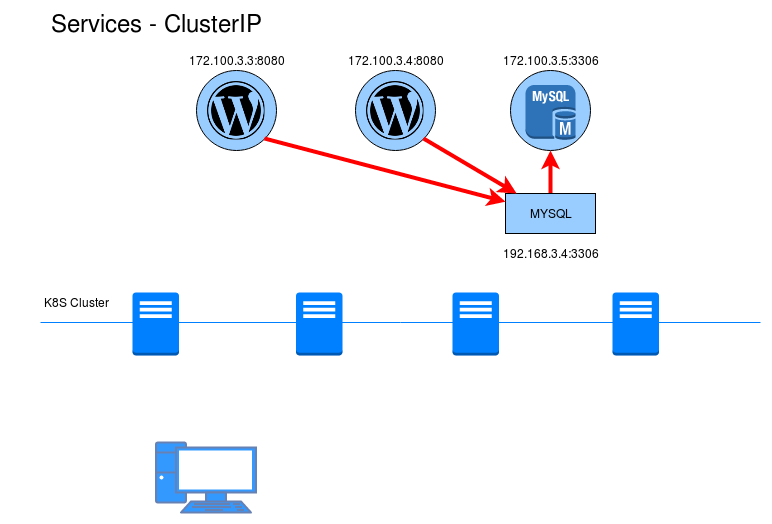
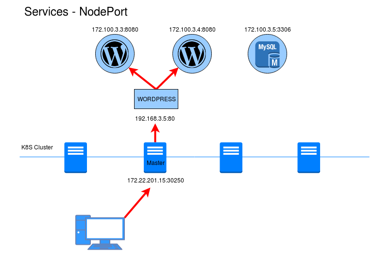
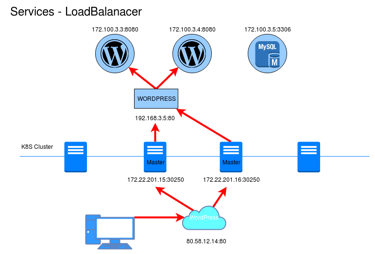

# Services. Tipos de servicios

Los servicios ([services](https://kubernetes.io/docs/concepts/services-networking/service/)) nos permiten acceder a nuestra aplicaciones.

* Un servicio es una abstracción que **nos permite acceder a un conjunto de pods** (que se han creado a partir de un Deployment) que implementan una aplicación (Por ejemplo: acceder a un servidor web, a una servidor de base de datos, a un microservicio que forma parte de una aplicación,...).
* A los Pods se le asignan una IP a la que no se puede acceder directamente, por lo tanto necesitamos un service que nos ofrece **una dirección virtual (CLUSTER-IP) y un nombre** que identifica al conjunto de pods que representa, al cual nos podemos conectar.
* La conexión al servicio se puede realizar **desde otros pods o desde el exterior** (mediante la generación aleatoria de un puerto). Por ejemplo, si tenemos una aplicación formada por dos servicios: servidor web y servidor de base de datos, tendremos que acceder desde el exterior al servidor web, y acceder al servidor de base de datos desde el servidor web. En principio no será necesario acceder al servidor de base de datos desde el exterior.
* Si el despliegue que hemos creado tiene más de un pod asociado, el servicio que representa el acceso a esta aplicación **balanceará la carga** entre los Pods con una política Round Robin.
* En el cluster existirá un componente que nos ofrece un **servicio DNS**. Cada vez que creamos un services se actualizará el DNS para resolver el nombre que hemos asignado al servicio con la IP virtual (CLUSTER-IP) que se le ha asignado.
 
## Tipos de servicios

### ClusterIP

Solo permite el acceso interno a un servicio de este tipo, es decir si tenemos un despliegue con una aplicación a la que no es necesaria acceder desde el esxterior, crearemos un service de este tipo par que otras aplicaciones puedan acceder a ella (por ejemplo, una base de datos). Es el tipo por defecto. Si deseamos seguir accediendo desde el exterior, para hacer pruebas durante la fase de daesarrollo podemos seguir utilizando la instrucción `kubectl port-forward`.

### NodePort

Abre un puerto, para que el servicio sea accesible desde el exterior. Por defecto el puerto generado está en el rango de 30000:40000. Para acceder usamos la ip del servidor master del cluster y el puerto asignado.

### LoadBalancer

Este tipo sólo está soportado en servicios de cloud público (GKE, AKS o AWS). El proveedor asignara un recurso de balanceo de carga para el acceso a los servicios. si usamos un cloud privado, como OpenSatck necesitaremos un plugin para configurar el funcionamiento. este tipo de servicio no lo vamos a utilizar en el presente curso.

