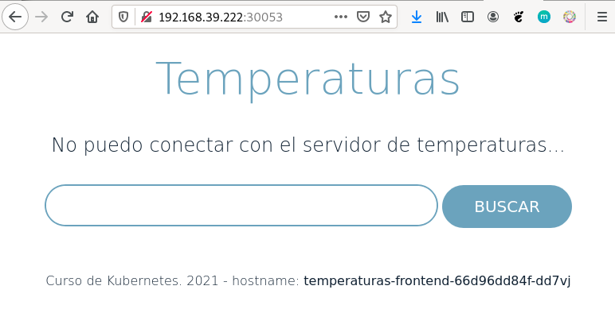
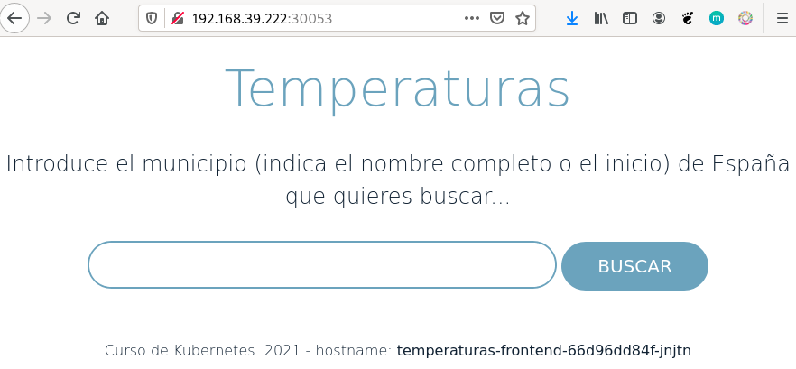
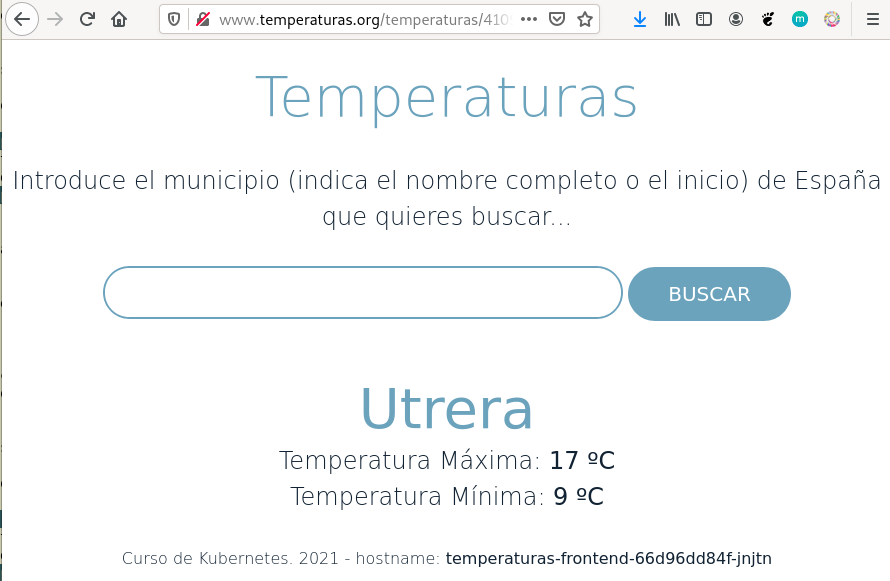

# Ejemplo completo: Desplegando y accediendo a la aplicación Temperaturas

Vamos a hacer un despliegue completo de una aplicación llamada **Temperaturas**. Esta aplicación nos permite consultar la temperatura mínima y máxima de todos los municipios de España y estará formada por dos microservicios:

* `frontend`: Es una aplicación escrita en Python que nos ofrece una página web para hacer las búsquedas y visualizar los resultados. Este microservicio hará peticiones HTTP al segundo microservicio para obtener la información.
* `backend`: Es el segundo microservicio que nos ofrece un servicio web de tipo API Restful. A esta API Web podemos hacerles consultas sobre los municipios y sobre las temperaturas.

Algunas consideraciones sobre el despliegue que vamos a realizar:

* Como la aplicación está formada por dos microservicios, tendremos que crear dos recursos Deployment para desplegar y controlar los Pods de cada despliegue por separado.
* Necesitaremos acceder desde el exterior al microservicio `frontend` por lo que crearemos un recurso Service de tipo NodePort.
* Al componente `backend` no es necesario acceder desde el exterior, por lo tanto crearemos un recurso Service de tipo ClusterIP para permitir que se acceda desde `frontend`.
* Para terminar usaremos un recurso Ingress para acceder al componente `frontend` por lo tanto, en ese momento, no es necesario que el Service para acceder a ese componente sea de tipo NodePort, bastaría con que fuera ClusterIP.

## Despliegue y acceso al microservicio frontend

En primer lugar vamos a desplegar el primer microservicio. Esta aplicación está usando el puerto 3000/tcp para ofrecer la aplicación. Para describir el despliegue utilizaremos el fichero [`frontend-deployment.yaml`](files/temperaturas/frontend-deployment.yaml) y para crear el despliegue ejecutaremos la siguiente instrucción:

    kubectl apply -f frontend-deployment.yaml

A continuación usamos el fichero [`frontend-srv.yaml`](files/temperaturas/frontend-srv.yaml) para crear el Service NodePort:

    kubectl apply -f frontend-srv.yaml

Obtenemos los recursos que hemos creado. Nos fijamos en el puerto que nos ha asignado por el Service NodePort (en mi caso el 30053). Vamos a acceder desde un navegador web usando la ip del nodo master y el puerto que nos han asignado:

Como podemos observar la aplicación nos muestra un mensaje de error: **"No puedo conectar con el servidor de temperaturas...**. Evidentemente el componente `frontend` está intentando conectar con el componente `backend` y, evidentemente, no puede, ya que ni la hemos desplegado, ni hemos creado el Service correspondiente.

## Despliegue y acceso al microservicio backend

Es el momento de desplegar el segundo microservicio. Este microservicio ofrece un servicio API Restful en el puerto 5000/tcp. Para ello utilizaremos el fichero [`backend-deployment.yaml`](files/temperaturas/backend-deployment.yaml) para realizar el despliegue y el fichero [`backend-srv.yaml`](files/temperaturas/backend-srv.yaml) para crear el Service.

    kubectl apply -f backend-deployment.yaml
    kubectl apply -f backend-srv.yaml

Si volvemos acceder al navegador y refrescamos la página, veremos que ya no nos sale el mensaje de error y podemos buscar la temperatura de nuestra ciudad:

**Nota: Por defecto el componente frontend hace peticiones al componente backend utilizando el nombre `temperaturas-backend`, que es el nombre que hemos asignado al Service ClusterIP para el acceso al backend. En el próximo módulo veremos como podemos cambiar la configuración de frontend para cambiar el nombre del servicio web al que conecta.**

## Algunas consideraciones acerca del despliegue que hemos realizado

Esta manera de trabajar donde cada microservicio que forma parte de la aplicación (o si tenemos una aplicación que necesite varios servicios (servidor web, servidor de base de datos,...)) se despliega de forma separada usando distintos recursos Deployment nos proporciona las siguientes características:

1. Cada conjunto de Pods creado en cada despliegue ejecutará un solo proceso para ofrecer un servicio o microservicio.
2. Cada conjunto de Pods se puede escalar de manera independiente. Esto es importante ya que si identificamos que al acceder a alguno de los servicios se crea un cuello de botella, podemos escalarlo para tener más Pods ejecutando el servicio. En el ejemplo que hemos desarrollado, se crearon 3 Pods del frontend y un Pod del backend, pero se pueden escalar independientemente los dos despliegues. Te invito a escalar los dos despliegues y comprobar que sigue funcionando la aplicación.
3. Las actualizaciones de los distintos servicios / microservicios no interfieren en el resto. 
4. Lo estudiaremos en un módulo posterior, pero podremos gestionar el almacenamiento de cada servicio de forma independiente.
5. Ya lo hemos comentado, pero con esta aplicación podemos observar el balanceo de carga que realiza el Service al acceder al `frontend`: la aplicación visualiza el nombre del servidor que está ofreciendo la página. Por lo tanto si vamos refrescando la página con F5 observaremos cómo se va realizando el balanceo de carga y va cambiando el nombre del Pod al que está accediendo.

## Acceso a la aplicación usando el Ingress Controller

Para terminar vamos a crear un recurso Ingress que nos posibilite acceder a la aplicación utilizando un nombre. Como hemos indicado al utilizar Ingress no es necesario que el Service al que accede sea de tipo NodePort, por lo tanto lo primero que vamos a hacer es cambiar el tipo de Service que accede a `frontend` y lo vamos a poner ClusterIP, para ello vamos a modificar el fichero `frontend-srv.yaml` cambiando el tipo de Service de NodePort a ClusterIP, y posteriormente aplicamos los cambios:

    kubectl apply -f frontend-srv.yaml

Comprobamos que realmente ha cambiado el tipo de Service, y que ya no tenemos un puerto para acceder usando la ip del nodo master.

A continuación usamos el fichero  [`ingress.yaml`](files/temperaturas/ingress.yaml) para crear el recurso Ingress, que definirá el nombre del host `www.temperaturas.org` que tendremos que introducir en la resolución estática tay como hemos visto anteriormente. Por lo tanto modificamos el fichero `/etc/hosts` de nuestro ordenador con la siguiente línea:

    192.168.39.222  www.temperaturas.org

Creamos el recurso Ingress:

    kubectl apply -f ingress.yaml

Y accedemos a la aplicación usando el nombre:

