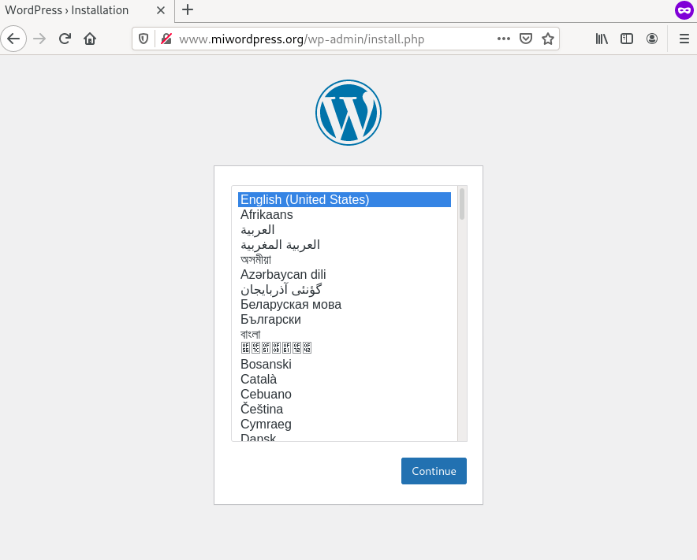

# Ejemplo completo: Despliegue y acceso a Wordpress + MariaDB

En este ejemplo vamos a desplegar el CMS Wordpress y la base de datos MariaDB para su correcto funcionamiento. Cada uno de los servicios se van a desplegar independientemente, y configuraremos los Services para acceder desde el exterior a la aplicación y para que el Wordpress pueda acceder a la base de datos:

## Configuración de los contenedores

* Como hemos estudiado en los ejemplos vistos en este módulo, al crear el despliegue de MariaDB tendremos que configurar las siguientes variables de entorno: `MYSQL_ROOT_PASSWORD` (contraseña del usuario root de la base de datos), `MYSQL_DATABASE` (el nombre de la base de datos que se va a crear), `MYSQL_USER` (nombre del usuario de la base de datos que se va carear), `MYSQL_PASSWORD` (contraseña de este usuario).
* Si comprobamos la documentación de la imagen [Wordpress en Docker Hub](https://hub.docker.com/_/wordpress) las variables de entorno que vamos a definir son las siguientes: `WORDPRESS_DB_HOST` (la dirección del servidor de base de datos), `WORDPRESS_DB_USER` (el usuario que se va a usar para acceder a la base de datos), `WORDPRESS_DB_PASSWORD` (la contraseña de dicho usuario) y `WORDPRESS_DB_NAME` (el nombre de la base de datos a las que vamos a conectar para gestionar las tablas de Wordpress).

Evidentemente los valores de estas variables tienen que coincidir, es decir, el usuario y la contraseña que creemos en la base de datos serán las mismas que utilicemos desde Wordpress para acceder a la base de datos, y el nombre de la base de datos usada por WordPres será el mismo que la base de datos creada en MariaDB.

Lo veremos posteriormente, pero adelantamos, que el valor de la variable `WORDPRESS_DB_HOST` será el nombre del Service que creemos para acceder a la base de datos, como ya hemos estudiado, se creará un registro en el DNS del cluster que permitirá que Wordpress acceda a la base de datos usando el nombre del Service.

Los valores para crear la base de datos y el usuario en MariaDB, que corresponden a las credenciales que vamos a usar en Wordpress, los vamos a guardar en dos recursos de nuestro cluster: los datos no sensibles (nombre de usuario y nombre de la base de datos) lo guardaremos en un ConfigMap y los datos sensibles, las contraseñas, la guardaremos en un Secret.

Para ello ejecutamos las siguientes instrucciones:

    kubectl create cm bd-datos --from-literal=bd_user=user_wordpress \
                               --from-literal=bd_dbname=wordpress

    kubectl create secret generic bd-passwords --from-literal=bd_password=password1234 \
                                               --from-literal=bd_rootpassword=root1234

**Nota: No hemos guardado la definición del ConfigMap y el Secret en un fichero yaml. De esta manera evitamos que información sensible sea guardada por ejemplo en un repositorio git.** 

Sin embargo, a partir de las instrucciones anteriores podemos generar ficheros yaml que posteriormente añadimos a la configuración del cluster. Podemos ejecutar:

    kubectl create cm bd-datos --from-literal=bd_user=user_wordpress \
                               --from-literal=bd_dbname=wordpress \
                               -o yaml --dry-run=client > bd_datos_configmap.yaml

    kubectl create secret generic bd-passwords --from-literal=bd_password=password1234 \
                                               --from-literal=bd_rootpassword=root1234 \
                                               -o yaml --dry-run=client > bd_passwords_secret.yaml

Con la opción `--dry-run=client`, *kubectl* va a simular la creación del recurso, pero no se llega a ejecutar, sin embargo con la opción `-o yaml` generamos el fichero yaml con la definición del recurso. Posteriormente sólamente tendremos que ejecutar las siguientes instrucciones para crear los dos recursos:

    kubectl apply -f bd_datos_configmap.yaml
    kubectl apply -f bd_passwords_secret.yaml

## Despliegue de la base de datos

Para desplegar la base de datos vamos a usar el fichero [`mariadb-deployment.yaml`](files/wordpress/mariadb-deployment.yaml). Podemos observar en el fichero cómo los datos de las variables de entorno del contenedor se inicalizan con los valores que hemos creado en el ConfigMap y en el Secret anterior. Ejecutamos:

    kubectl apply -f mariadb-deployment.yaml

La definición del Service que vamos a crear lo tenemos en el fichero: [`mariadb-srv.yaml`](files/wordpress/mariadb-srv.yaml). Como comprobamos en la definición estamos creando un Service del tipo ClusterIP, ya que no vamos a acceder a la base de datos desde el exterior. Además es importante recordar el nombre que hemos puesto al Service (`mariadb-service`), ya que cómo hemos indicado posteriormente, usaremos este nombre para configurar la aplicación Wordpress a la hora de indicar el servidor de base de datos. Ejecutamos:

    kubectl apply -f mariadb-srv.yaml

## Despliegue de la aplicación Wordpress

Para desplegar la aplicación Wordpress vamos a usar el fichero [`wordpress-deployment.yaml`](files/wordpress/wordpress-deployment.yaml). Podemos observar en el fichero cómo los datos de las variables de entorno del contenedor se inicializan con los valores que hemos creado en el ConfigMap y en el Secret anterior. Además, comprobamos que la variable de entorno `WORDPRESS_DB_HOST` se inicializa a `mariadb-service`, que es el nombre del Service creado para a acceder a mariaDB. Ejecutamos:

    kubectl apply -f wordpress-deployment.yaml

La definición del Service que vamos a crear la tenemos en el fichero: [`wordpress-srv.yaml`](files/wordpress/wordpress-srv.yaml). Como comprobamos en la definición estamos creando un Service del tipo NodePort, pero también podríamos haberlo configurado de tipo ClusterIP, porque posteriormente vamos a crear un recurso Ingress para acceder a la aplicación. Ejecutamos:

    kubectl apply -f wordpress-srv.yaml

## Acceso a la aplicación

Para acceder a la aplicación vamos a crear un recurso Ingress que tenemos definido en el fichero: [`wordpress-ingress.yaml`](files/wordpress/wordpress-ingress.yaml). Como podemos observar vamos a usar el nombre `www.miwordpress.org` que tendremos que añadir en la resolución estática del ordenador desde el que vamos a acceder. También es interesante observar a que Service se va acceder con este recurso Ingress, el nombre del Service es `wordpress-service` que evidentemente es el mismo que hemos puesto en la definición del Service de Wordpress.

Una vez que comprobemos que todos los recursos están funcionando, podemos acceder a nuestra aplicación:

## Vídeo

[https://www.youtube.com/watch?v=Iy6MaixXSrw](https://www.youtube.com/watch?v=Iy6MaixXSrw)
