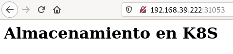

# Ejemplo 2: Gestión dinámica de volúmenes

En este ejemplo vamos a desplegar un servidor web que va a servir una página html que tendrá almacenada en un volumen. En esta ocasión, la asignación del volumen se va a realizar de forma dinámica.

## Aprovisonamiento del volumen

Para que la asignación del voluemn (objeto *PersitentVolume*) se haga de forma dinámica al crear ela solicitud (objeto *PersitentVolumeClaim*) es necesario tener configurado un provisonador de almacenamiento que se define en un objeto `StorageClass`. Como vimos en minikube tenemos configurado un provisonador para volúmenes de tipo *hostPath*:

```bash
kubectl get storageclass
NAME                 PROVISIONER                RECLAIMPOLICY   VOLUMEBINDINGMODE   ALLOWVOLUMEEXPANSION   AGE
standard (default)   k8s.io/minikube-hostpath   Delete          Immediate           false                  46d
```

De tal manera que cuando creemos una solicitud de volumen (objeto *PersitentVolumeClaim*) se creara de forma dinámica un objeto *PersitentVolume*, que se asociaría a la solicitud.

## Solicitud del volumen

Vamos a realizar la solicitud de volumen, en este caso usaremos el fichero [`pvc-ejemplo2.yaml`](files/ejemplo2/pvc-ejemplo2.yaml):

```yaml
apiVersion: v1
kind: PersistentVolumeClaim
metadata:
    name: pvc-ejemplo2
spec:
  accessModes:
    - ReadWriteMany
  resources:
    requests:
      storage: 1Gi
```
**Nota**: Fíjate que esta definición hemos quitado la declaración `storageClassName: manual`, al no ponerla se eligira el `storageclass` por defecto que en este caso se llama `standard` y que hemos visto anteriormente su definición en minikube.

Cuando creemos el objeto *PersistentVolumeClaim*, veremos que de forma dinámica se creará un *PersitentVolumen* que se asociará a nuestra solicitud::

```bash
$ kubectl apply -f pvc-ejemplo2.yaml

$ kubectl get pv,pvc
NAME                                                        CAPACITY   ACCESS MODES   RECLAIM POLICY   STATUS   CLAIM                  STORAGECLASS   REASON   AGE
persistentvolume/pvc-6a09c69a-4344-447c-b23d-d85c7edd7f36   1Gi        RWX            Delete           Bound    default/pvc-ejemplo2   standard                1s

NAME                                 STATUS   VOLUME                                     CAPACITY   ACCESS MODES   STORAGECLASS   AGE
persistentvolumeclaim/pvc-ejemplo2   Bound    pvc-6a09c69a-4344-447c-b23d-d85c7edd7f36   1Gi        RWX            standard       1s
```
**Nota**: En este caso, como el volumen se ha generado dinámica, su capacidad es igual a la solicitada, 1 Gb.

Cómo el volumen ha sido generado de forma dinámica por el provisonador, éste habra escogido una carpeta del host que correspona al volumen.

```bash
$ kubectl describe persistentvolume/pvc-6a09c69a-4344-447c-b23d-d85c7edd7f36
...
Source:
    Type:          HostPath (bare host directory volume)
    Path:          /tmp/hostpath-provisioner/default/pvc-ejemplo2
...
```

## Uso del volumen

A partir de este punto el ejercicio es muy parecido al que vimos en el ejemplo1: creamos el despliegue usando el fichero [`deploy-ejemplo2.yaml`](files/ejemplo1/deploy-ejemplo2.yaml):

```yaml
apiVersion: apps/v1
kind: Deployment
metadata:
  name: nginx-ejemplo2
  labels:
    app: nginx
spec:
  replicas: 1
  selector:
    matchLabels:
      app: nginx
  template:
    metadata:
      labels:
        app: nginx
    spec:
      volumes:
        - name: volumen-ejemplo2
          persistentVolumeClaim:
            claimName: pvc-ejemplo2
      containers:
        - name: contenedor-nginx
          image: nginx
          ports:
            - name: http-server
              containerPort: 80
          volumeMounts:
            - mountPath: "/usr/share/nginx/html"
              name: volumen-ejemplo2
```

Creamos el despliegue:

```bash
$ kubectl apply -f deploy-ejemplo2.yaml
```

Y a continuación, cuando el contenedor esté funcionando, creamos el fichero `index.html`:

```bash
$ kubectl get all
...
NAME                                 READY   STATUS    RESTARTS   AGE
pod/nginx-ejemplo2-7b79b5966-zbdqh   1/1     Running   0          5s
...
$ kubectl exec pod/nginx-ejemplo2-7b79b5966-zbdqh -- bash -c "echo '<h1>Almacenamiento en K8S</h1>' > /usr/share/nginx/html/index.html"
```
Finalmente creamos el servicio de acceso al despliegue, usando el fichero [`srv-ejemplo1.yaml`](files/ejemplo1/srv-ejemplo1.yaml).

```bash
$ kubectl apply -f srv-ejemplo2.yaml

$ kubectl get all
...
service/nginx-ejemplo2   NodePort    10.99.48.24   <none>        80:31053/TCP   3s
...
```

Y accedemos a la aplicación, accedo a la ip del nodo controlador del cluster y al puerto asignado al servicio NodePort:

```bash
minikube ip
192.168.39.222
```



Finalmente puedes volver a comprobar que la información de la aplicación no se pierde borrando el despliegue y volviéndolo a crear, y comprobar que se sigue sirviendo el fichero `index.html`.

## Eliminación del volumen