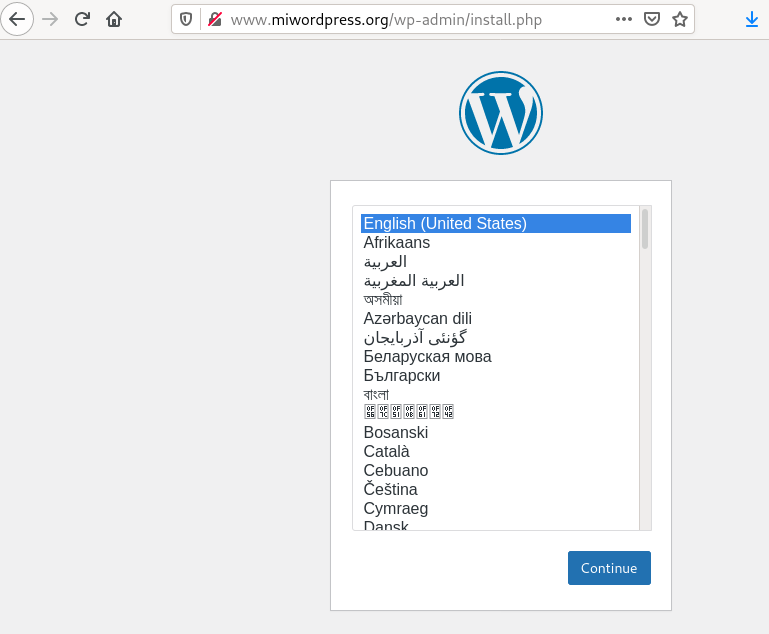
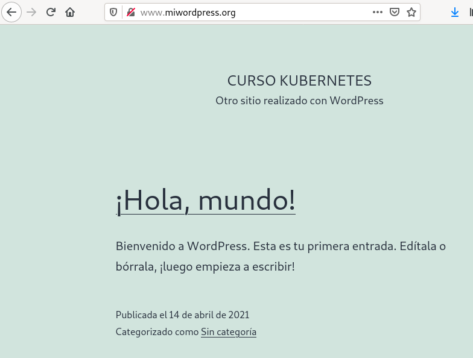

# Ejemplo 3: WordPress con almacenamiento persistente

En este ejemplo vamos a volver e realizar el [Ejemplo completo: Despliegue y acceso a WordPress + MariaDB](../modulo7/wordpress.md) del módulo anterior, pero añadiendo el almacenamiento necesario para que la aplicación sea persistente. 

Para llevar a cabo esta tarea necesitaremos tener a nuestra disposición dos volúmenes: uno para guardar la información de WordPress y otro para guardar la información de MariaDB.

Para este ejercicio utilizaremos asignación dinámica de volúmenes.

## Creación de los volúmenes necesarios

Como hemos comentado vamos a usar la asignación dinámica de volúmenes, por lo tanto tendremos que crear dos objetos *PersistantVolumenClaim* para solicitar los dos volúmenes.

Para solicitar el volumen para la aplicación WordPressusaremos el fichero [`wordpress-pvc.yaml`](files/wordpress/wordpress-pvc.yaml):

```yaml
apiVersion: v1
kind: PersistentVolumeClaim
metadata:
    name: wordpress-pvc
spec:
  accessModes:
    - ReadWriteMany
  resources:
    requests:
      storage: 5Gi
```

Y para solicitar el volumen para la base de datos usaremos un fichero similar: [`mariadb-pvc.yaml`](files/mariadb/wordpress-pvc.yaml):

```yaml
apiVersion: v1
kind: PersistentVolumeClaim
metadata:
    name: mariadb-pvc
spec:
  accessModes:
    - ReadWriteMany
  resources:
    requests:
      storage: 5Gi
```

Creamos las solicitudes y comprobamos que se ha asociado un volúmen a cada una de ellas:

```bash
$ kubectl apply -f wordpress-pvc.yaml
$ kubectl apply -f mariadb-pvc.yaml

$ kubectl get pv,pvc
NAME                                                        CAPACITY   ACCESS MODES   RECLAIM POLICY   STATUS   CLAIM                   STORAGECLASS   REASON   AGE
persistentvolume/pvc-01ed3c4c-a542-4161-93a9-b9d5ea2bf6d1   5Gi        RWX            Delete           Bound    default/wordpress-pvc   standard                10s
persistentvolume/pvc-78acc14b-71da-4cf0-861d-0ab7780bca4f   5Gi        RWX            Delete           Bound    default/mariadb-pvc     standard                10s

NAME                                  STATUS   VOLUME                                     CAPACITY   ACCESS MODES   STORAGECLASS   AGE
persistentvolumeclaim/mariadb-pvc     Bound    pvc-78acc14b-71da-4cf0-861d-0ab7780bca4f   5Gi        RWX            standard       10s
persistentvolumeclaim/wordpress-pvc   Bound    pvc-01ed3c4c-a542-4161-93a9-b9d5ea2bf6d1   5Gi        RWX            standard       10s
```

## Modificación de los deployment para el uso de los volúmenes

A continuación vamos a modificar el fichero [`wordpress-deployment.yaml`](files/wordpress/wordpress-deployment.yaml) para añadir el volumen al Pod y el punto de montaje:

```yaml
...
    spec:
      containers:
      ...
          volumeMounts:
            - name: wordpress-vol
              mountPath: /var/www/html
      volumes:
        - name: wordpress-vol
          persistentVolumeClaim:
            claimName: wordpress-pvc      
```
Como observamos vamos a usar el volumen asociado al *PersistantVolumenClaim* `wordpress-pvc` y que lo vamos a montar en el directorio *Documentroot* del servidor web: `/var/www/html`.

De forma similar, modificamos el fichero [`mariadb-deployment.yaml`](files/wordpress/mariadb-deployment.yaml):

```yaml
...
    spec:
      containers:
    ...
          volumeMounts:
            - name: mariadb-vol
              mountPath: /var/lib/mysql
      volumes:
        - name: mariadb-vol
          persistentVolumeClaim:
            claimName: mariadb-pvc      

```
En esta ocasión usaremos el volumen asociado a `mariadb-pvc` y el punto de montaje se hará sobre el directorio donde se guarda la informaciónd e la base de datos: `/var/lib/mysql`.

Evidntemente, no es necesario modificar la defininción de los otrs recursos: services e ingress.

Creamos el despliegue, los servicios y el ingress:

```bash
$ kubectl apply -f mariadb-deployment.yaml
$ kubectl apply -f mariadb-srv.yaml
$ kubectl apply -f wordpress-deployment.yaml
$ kubectl apply -f wordpress-srv.yaml
$ kubectl apply -f wordpress-ingress.yaml
```

Acedemos a la aplicación y la configuramos:




## Comprobando la persistencia de la información

Si en cualquier momento tenemos que eliminar o actualizar uno de los despliegues, podemos comprobar que la información sigue existiendo después de volver a crear los despliegues:

```bash
$ kubectl delete -f mariadb-deployment.yaml
$ kubectl delete -f wordpress-deployment.yaml
$ kubectl apply -f mariadb-deployment.yaml
$ kubectl apply -f wordpress-deployment.yaml
```

Si volvemos acceder, comprobamos que la aplicación sigue funcionando con toda la información:

